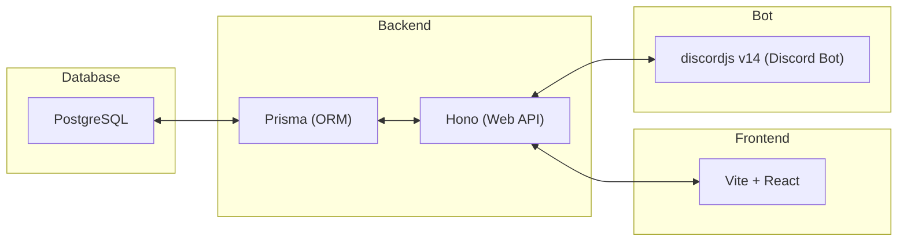

# debt-manager

## 使用する技術スタック

`Frontend`、`Backend`、`Database`の単位でDocker化し、docker-composeで連携する。

また、debt-managerは、pnpmのworkspace機能を利用して、`bot`、`frontend`、`backend`の3つのパッケージで構成されている。

### Bot

- TypeScript
- discordjs v14

### Frontend

- TypeScript
- CSS Modules
- Vite + React

### Backend

- TypeScript
- Hono
- Prisma (ORM)

### Database

- PostgreSQL

## 全体構成図

### Project構成
