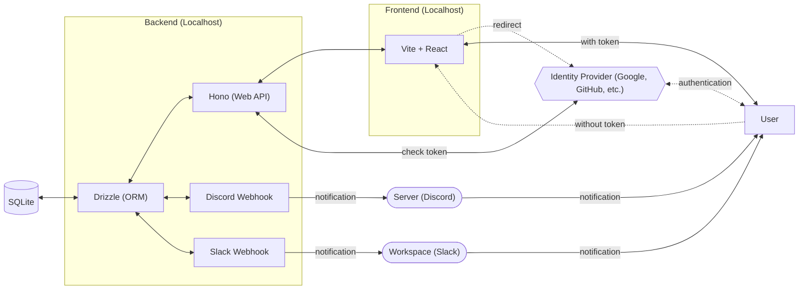
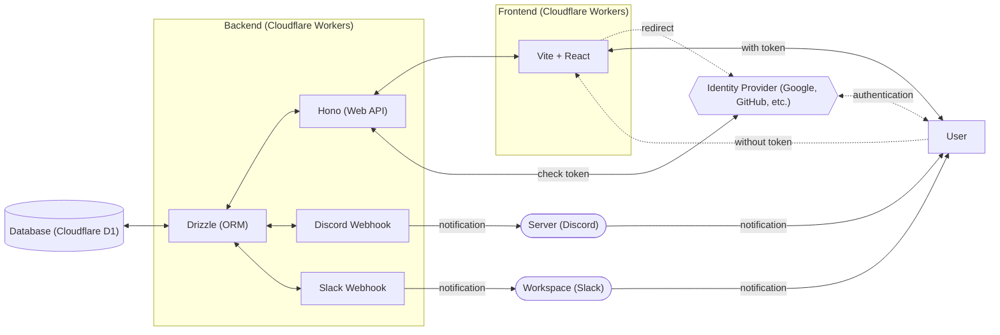

# debt-manager

[](https://github.com/Myxogastria0808/debt-manager/actions/workflows/test.yaml)
[](https://github.com/Myxogastria0808/debt-manager/actions/workflows/docs.yaml)


[](#)

## セットアップ

0. いくつかのツールをインストール

- Node.js
- pnpm
- vscode extensions
  - `astro-build.astro-vscode`
  - `esbenp.prettier-vscode`
  - `dbaeumer.vscode-eslint`
  - `clinyong.vscode-css-modules`

1. このレポジトリをクローン

```sh
git clone https://github.com/Myxogastria0808/debt-manager.git
cd debt-manager
```

2. 以下のコマンドを実行

```sh
pnpm i && pnpm run backend:generate && pnpm run backend:local:migration
```

2. `y` を入力して環境を移行する

```sh
✔ About to apply 1 migration(s)
Your database may not be available to serve requests during the migration, continue? [y/N] y
```

## ドキュメント

https://myxogastria0808.github.io/debt-manager/

## 技術スタック

### Frontend

- TypeScript
- CSS Modules
- Vite + React
- React Router (for routing)

#### [Live Demo](https://debt-manager.yukiosada.work/)
- https://debt-manager.yukiosada.work/

#### [Source Code](https://github.com/Myxogastria0808/debt-manager/tree/dev/products/frontend/)
- https://github.com/Myxogastria0808/debt-manager/tree/dev/products/frontend/

#### [Details](https://github.com/Myxogastria0808/debt-manager/tree/dev/products/frontend/README.md)
- https://github.com/Myxogastria0808/debt-manager/tree/dev/products/frontend/README.md

#### [Vitest UI Report](https://myxogastria0808.github.io/debt-manager/vitest/frontend/)
- https://myxogastria0808.github.io/debt-manager/vitest/frontend/

#### [Coverage Report](https://myxogastria0808.github.io/debt-manager/coverage/frontend/)
- https://myxogastria0808.github.io/debt-manager/coverage/frontend/

### Backend

- TypeScript
- Hono (Web Framework)
- fetch API (for calling Webhook)
- Drizzle (ORM)

#### [Live Demo](https://debt-manager-api.yukiosada.work/)
- https://debt-manager-api.yukiosada.work/

#### [Source Code](https://github.com/Myxogastria0808/debt-manager/tree/dev/products/backend/)
- https://github.com/Myxogastria0808/debt-manager/tree/dev/products/backend/

#### [Details](https://github.com/Myxogastria0808/debt-manager/tree/dev/products/backend/README.md)
- https://github.com/Myxogastria0808/debt-manager/tree/dev/products/backend/README.md

#### [Vitest UI Report](https://myxogastria0808.github.io/debt-manager/vitest/backend/)
- https://myxogastria0808.github.io/debt-manager/vitest/backend/

#### [Coverage Report](https://myxogastria0808.github.io/debt-manager/coverage/backend/)
- https://myxogastria0808.github.io/debt-manager/coverage/backend/

### Database

- development
  - SQLite
- production
  - Cloudflare D1

### Docs

- Astro

#### [Docs](https://github.com/Myxogastria0808/debt-manager/tree/dev/docs/)
- https://github.com/Myxogastria0808/debt-manager/tree/dev/docs/

#### [Details](https://github.com/Myxogastria0808/debt-manager/tree/dev/docs/README.md)
- https://github.com/Myxogastria0808/debt-manager/tree/dev/docs/README.md

## CI/CD

- GitHub Actions with Nix

#### [CI/CD](https://github.com/Myxogastria0808/debt-manager/tree/dev/.github/workflows/)
- https://github.com/Myxogastria0808/debt-manager/tree/dev/.github/workflows/

## テストツール

- Vitest

## 開発ツール

> [!WARNING]
> このプロジェクトは、 pnpmのみサポートしています。 npmやyarnなどはサポートしていません。

- pnpm (with workspace feature)
- turbo (monorepo management tool)
- Nix (optional tool)

## システム構成図 ~ 開発環境 ~



## システム構成図 ~ 本番環境 ~



## ER図

```mermaid
```

## ブランチ戦略

### main

main branch is the release branch.

### dev

dev branch is the development root branch.


### feature

- feat/#[issue-number]-[issue-summary]

  example) feat/#12-add-card-button-component

### chore

- chore/#[issue-number]-[issue-summary]

  example) chore/#12-add-prettier-config

### fix

- fix/#[issue-number]-[issue-summary]

  example) fix/#12-change-title

### update

- update/#[issue-number]-[issue-summary]

  example) update/#12-update-dependencies

### test

- test/#[issue-number]-[issue-summary]

  example) test/#12-add-unit-test

```mermaid
flowchart LR
    feature["feat/*"] --with loose checks--> dev["dev"]
    chore["chore/*"] --with loose checks--> dev["dev"]
    fix["fix/*"] --with loose checks--> dev["dev"]
    update["update/*"] --with loose checks--> dev["dev"]
    dev["dev"] --with strict checks--> main["main"]
    test["test/*"] --with loose checks--> dev["dev"]
    main["main"] --with strict checks (cron)--> main["main"]
```

#### with `loose checks` (`dev branch`)

- test (`push` and `pull requests`)
- docs (`push`)

#### with `strict checks` (`main branch`)

- test (`pull requests`)
- CodeQL Scanning (`pull requests`)
- deploy-frontend (`push` and `pull requests`)
- deploy-backend (`push` and `pull requests`)

#### with `strict checks (cron)` (`main branch`)

- test (`cron`)
