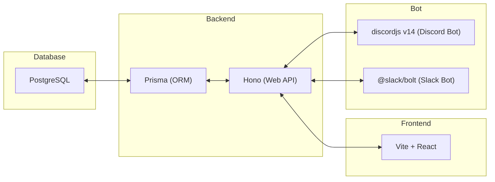
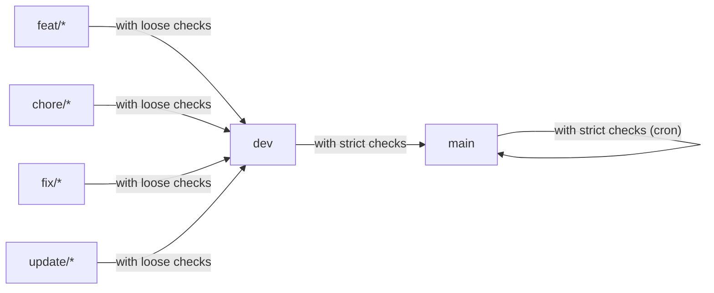

# debt-manager

## 使用する技術スタック

`Discord Bot`、`Slack Bot`、`Frontend`、`Backend`、`Database`の単位でDocker化し、docker-composeで連携する。

また、debt-managerは、pnpmのworkspace機能を利用して、`slack-bot`、`discord-bot`、`frontend`、`backend`の4つのパッケージで構成されている。

### Discord Bot

- TypeScript
- discordjs v14

### Slack Bot

- TypeScript
- @slack/bolt

### Frontend

- TypeScript
- CSS Modules
- Vite + React

### Backend

- TypeScript
- Hono
- Prisma (ORM)

### Database

- PostgreSQL

### Testing Tool

- Vitest

### CI/CD

- GitHub Actions with Nix

### Environment Management

- pnpm (with workspace feature)

- (Nix)

## 全体構成図

### Project構成

### ER図

## Branch Strategy

### main

main branch is the release branch.

### dev

dev branch is the development root branch.

### feature

- feat/#[issue-number]-[issue-summary]

  example) feat/#12-add-card-button-component

### chore

- chore/#[issue-number]-[issue-summary]

  example) chore/#12-add-prettier-config

### fix

- fix/#[issue-number]-[issue-summary]

  example) fix/#12-change-title

### update

- update/#[issue-number]-[issue-summary]

  example) update/#12-update-dependencies

### test

- test/#[issue-number]-[issue-summary]

  example) test/#12-add-unit-test

#### with `loose checks` (`dev branch`)

- dev-test (`push` and `pull requests`)
- docs-test (`push` and `pull requests`)
- docs (`push`)

#### with `strict checks` (`main branch`)

- prod-test (`pull requests`)
- docs-test (`pull requests`)

#### with `strict checks (cron)` (`main branch`)

- prod-test (`cron`)
- docs-test (`cron`)
