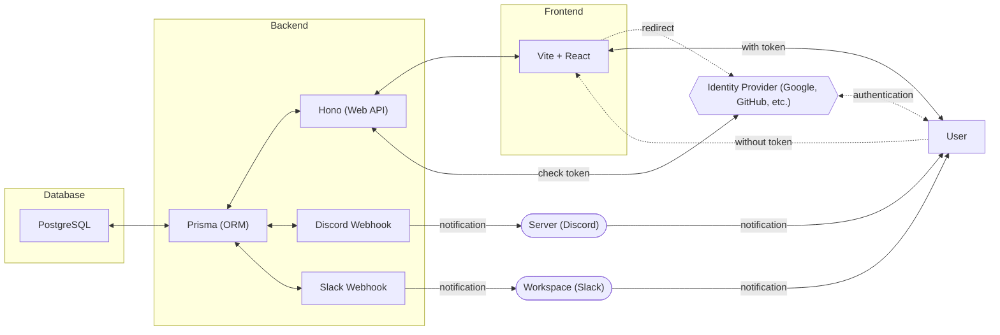
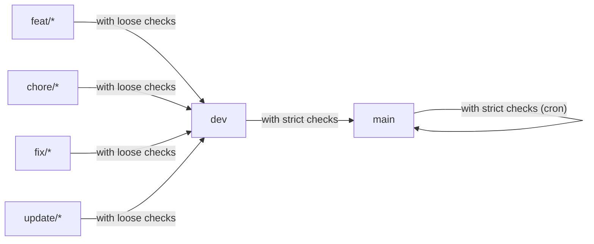

# debt-manager

## 使用する技術スタック

`frontend`、`backend`、`database`の単位でDocker化し、docker-composeで連携する。

また、debt-managerは、pnpmのworkspace機能を利用して、`frontend`、`backend`の2つのプロダクトで構成されている。

### Frontend

- TypeScript
- CSS Modules
- Vite + React

[product here](https://github.com/Myxogastria0808/debt-manager/products/frontend/)

[details here](https://github.com/Myxogastria0808/debt-manager/products/frontend/README.md)

### Backend

- TypeScript
- Hono (Web Framework)
- fetch API (for calling Webhook)
- Prisma (ORM)

[product here](https://github.com/Myxogastria0808/debt-manager/products/backend/)

[details here](https://github.com/Myxogastria0808/debt-manager/products/backend/README.md)

### Database

- PostgreSQL (RDBMS)

### Docs

- Astro

[docs here](https://github.com/Myxogastria0808/debt-manager/docs/)

[details here](https://github.com/Myxogastria0808/debt-manager/docs/README.md)

## CI/CD

- GitHub Actions with Nix

## Testing Tool

- Vitest

## Management Tool

> [!WARNING]
> This project only use pnpm (not yarn, npm or bun).

- pnpm (with workspace feature)
- turborepo (monorepo management tool)
- Nix (optional tool)

## 全体構成図

## Project構成

## ER図

## Branch Strategy

### main

main branch is the release branch.

### dev

dev branch is the development root branch.

### feature

- feat/#[issue-number]-[issue-summary]

  example) feat/#12-add-card-button-component

### chore

- chore/#[issue-number]-[issue-summary]

  example) chore/#12-add-prettier-config

### fix

- fix/#[issue-number]-[issue-summary]

  example) fix/#12-change-title

### update

- update/#[issue-number]-[issue-summary]

  example) update/#12-update-dependencies

### test

- test/#[issue-number]-[issue-summary]

  example) test/#12-add-unit-test

#### with `loose checks` (`dev branch`)

- dev-test (`push` and `pull requests`)
- docs (`push`)

#### with `strict checks` (`main branch`)

- prod-test (`pull requests`)

#### with `strict checks (cron)` (`main branch`)

- prod-test (`cron`)
