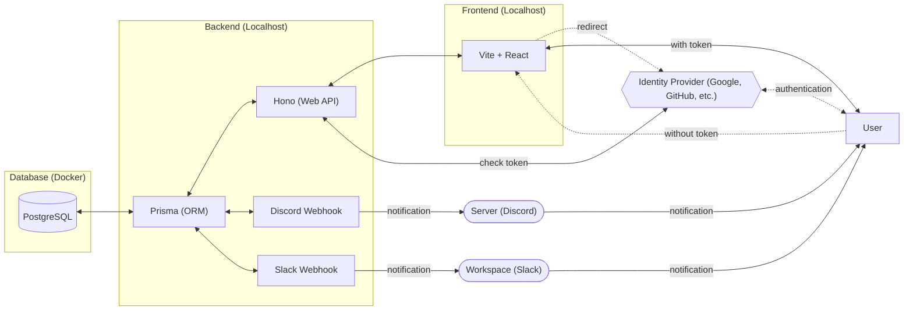
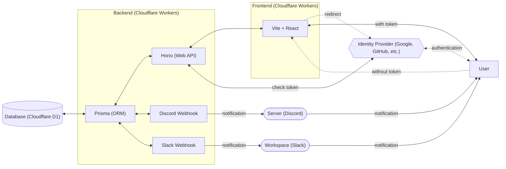

# debt-manager

## Technology stack used

Dockerize each component as `frontend`, `backend`, and `database`, and coordinate them using Docker Compose.
Additionally, debt-manager utilizes pnpm's workspace feature and consists of two products, `frontend` and `backend`, along with `docs`.

### Frontend

- TypeScript
- CSS Modules
- Vite + React

[Product Here](https://github.com/Myxogastria0808/debt-manager/products/frontend/)
- https://github.com/Myxogastria0808/debt-manager/products/frontend/

[Details Here](https://github.com/Myxogastria0808/debt-manager/products/frontend/README.md)
- https://github.com/Myxogastria0808/debt-manager/products/frontend/README.md

#### Vitest UI Report

[Vitest UI Report](https://myxogastria0808.github.io/debt-manager/vitest/frontend/)
- https://myxogastria0808.github.io/debt-manager/vitest/frontend/

#### Coverage Report

[Coverage Report](https://myxogastria0808.github.io/debt-manager/coverage/frontend/)
- https://myxogastria0808.github.io/debt-manager/coverage/frontend/

### Backend

- TypeScript
- Hono (Web Framework)
- fetch API (for calling Webhook)
- Prisma (ORM)

[Product Here](https://github.com/Myxogastria0808/debt-manager/products/backend/)
- https://github.com/Myxogastria0808/debt-manager/products/backend/

[Details Here](https://github.com/Myxogastria0808/debt-manager/products/backend/README.md)
- https://github.com/Myxogastria0808/debt-manager/products/backend/README.md

#### Vitest UI Report

[Vitest UI Report](https://myxogastria0808.github.io/debt-manager/vitest/backend/)
- https://myxogastria0808.github.io/debt-manager/vitest/backend/

#### Coverage Report

[Coverage Report](https://myxogastria0808.github.io/debt-manager/coverage/backend/)
- https://myxogastria0808.github.io/debt-manager/coverage/backend/

### Database

- PostgreSQL (RDBMS)

### Docs

- Astro

[Docs Here](https://github.com/Myxogastria0808/debt-manager/docs/)
- https://github.com/Myxogastria0808/debt-manager/docs/

[Details Here](https://github.com/Myxogastria0808/debt-manager/docs/README.md)
- https://github.com/Myxogastria0808/debt-manager/docs/README.md

## CI/CD

- GitHub Actions with Nix

[CI/CD Here](https://github.com/Myxogastria0808/debt-manager/.github/workflows/)
- https://github.com/Myxogastria0808/debt-manager/.github/workflows/

## Testing Tool

- Vitest

## Management Tool

> [!WARNING]
> This project only use pnpm (not yarn, npm or bun).

- pnpm (with workspace feature)
- turbo (monorepo management tool)
- Nix (optional tool)

## System Diagram ~Development~



## System Diagram ~Production~



## Entity Relationship Diagram (ER Diagram)

```mermaid
```

## Branch Strategy

### main

main branch is the release branch.

### dev

dev branch is the development root branch.


### feature

- feat/#[issue-number]-[issue-summary]

  example) feat/#12-add-card-button-component

### chore

- chore/#[issue-number]-[issue-summary]

  example) chore/#12-add-prettier-config

### fix

- fix/#[issue-number]-[issue-summary]

  example) fix/#12-change-title

### update

- update/#[issue-number]-[issue-summary]

  example) update/#12-update-dependencies

### test

- test/#[issue-number]-[issue-summary]

  example) test/#12-add-unit-test

```mermaid
flowchart LR
    feature["feat/*"] --with loose checks--> dev["dev"]
    chore["chore/*"] --with loose checks--> dev["dev"]
    fix["fix/*"] --with loose checks--> dev["dev"]
    update["update/*"] --with loose checks--> dev["dev"]
    dev["dev"] --with strict checks--> main["main"]
    main["main"] --with strict checks (cron)--> main["main"]
```

#### with `loose checks` (`dev branch`)

- dev-test (`push` and `pull requests`)
- docs (`push`)

#### with `strict checks` (`main branch`)

- prod-test (`pull requests`)

#### with `strict checks (cron)` (`main branch`)

- prod-test (`cron`)
