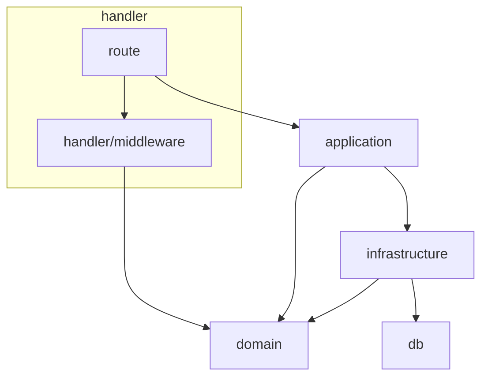
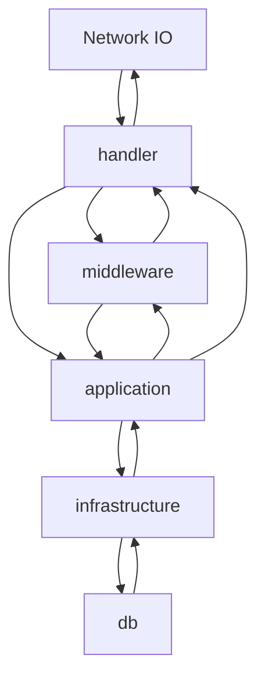

# debt-manager Backend

## Structure

This structure is inspired by layered architecture.

### handler

Define path routing

- dependencies
  - Hono

### handler/middleware

Define middleware

- dependencies
  - Hono

### application

Define business logic

- dependencies

### domain

Define models (not database schemas) and types

### infrastructure

Define database CRUD operations

> [TIPS!]
> All operations have to be minimal and atomic.

- dependencies
  - Drizzle

### db

Define database schema

- dependencies
  - Drizzle

## Dependencies

## Process Flow

